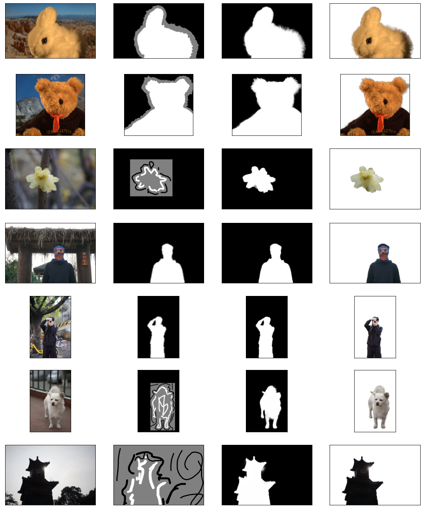

### Closed Form Matting

Customized implementation of the closed form matting alogrithm which is proposed by [A. Levin](http://people.csail.mit.edu/alevin/papers/Matting-Levin-Lischinski-Weiss-CVPR06.pdf)。This is an alogrithm for image matting by giving certain constraints, i.e. trimap or scribble.

#### Usage 

for trimap

```shell
python main.py --mode=matting --image=/path/to/your_image --trimap=/path/to/your_trimap_image --output_dir=/path/to/output
```

for scribble

```shell
python main.py --mode=matting --image=/path/to/your_image --trimap=/path/to/your_scribble_image --output_dir=/path/to/output
```

and in order to guide scribble, you may need smallest eigenvector of Laplacian

```shell
python main.py --mode=eigen --image=/path/to/your_image --output_dir=/path/to/output
```

#### Result

From left to right, [image, trimap/scribble, alpha, matting]



