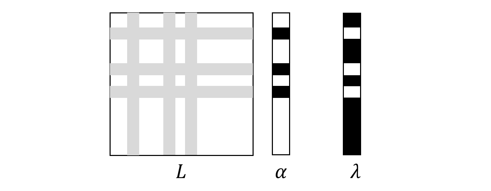

### Closed Form Matting 

##### 基于 closed form matting 抠图算法的 Java 实现

#### 用例

```java
String sourcePath = ...;
String trimapPath = ...;
String resultPath = ...;
ClosedFormMatting.run(sourcePath, trimapPath, resultPath);
```

#### 原理

> 参考论文: [Levin, Anat, Dani Lischinski, and Yair Weiss. "A closed-form solution to natural image matting." IEEE transactions on pattern analysis and machine intelligence 30.2 (2008): 228-242.](http://webee.technion.ac.il/people/anat.levin/papers/Matting-Levin-Lischinski-Weiss-CVPR06.pdf)

#### 优化

原论文中，构建的线性方程组如下图所示，对于一张 h * w 大小的图片，获得拉普拉斯矩阵的维度为 (h * w) x (h * w)，这是一个相当大的矩阵，如果完全表示出来则很会容易地将内存耗尽。观察 alpha 向量可以发现其中大部分都是已知量（白色区域），而 lambda 向量则和 alpha 相反，大部分是未知量（黑色区域）。在原论文中，为了求解该方程组，需要根据 alpha 向量的已知量来填充 lambda 的未知量（这和有限元中对刚度矩阵的改造是类似的原理）。



但事实上，我们完全用不着求解整个方程组，考虑到 L 矩阵所有量均已知，alpha 向量的黑色区域未知，lambda 向量的白色区域已知，我们可以只提取 L 矩阵的灰色区域，alpha 的黑色区域和 lambda 的白色区域形成新的线性方程组。假如在 trimap 图中，未知区域的像素占总像素的 1/10，那么新提取的线性方程组的规模将是原问题的 1/100。另一方面考虑到 L 矩阵是对称稀疏矩阵，所以灰色区域构成的矩阵仍然对称稀疏，在存储和求解方程组的时候可以使用对称稀疏矩阵的特殊方案进一步优化开销。